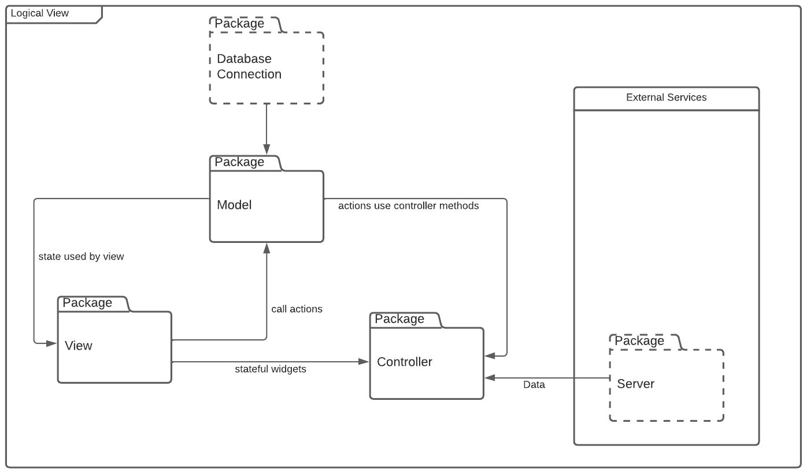
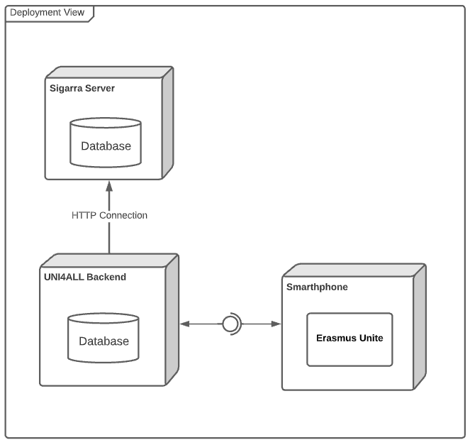

## Architecture and Design

### Logical architecture

In this project, our group, going towards the already built uni4all architecture, applied the MVC (Model, View, Controller) pattern.

Furthermore, the well functioning of our app requires the storing and retrieving of persisting data. Thus, a need for a database arises.

### Physical architecture

Regarding the physical architecture of our project, it relies on three separate blocks that communicate via HTTPS requests (backend and Sigarra's server) and an integration between uni4all's backend and our app front-end made with Flutter technology.

### Vertical prototype

Credits app screen as a prototype of our Flutter development

 

