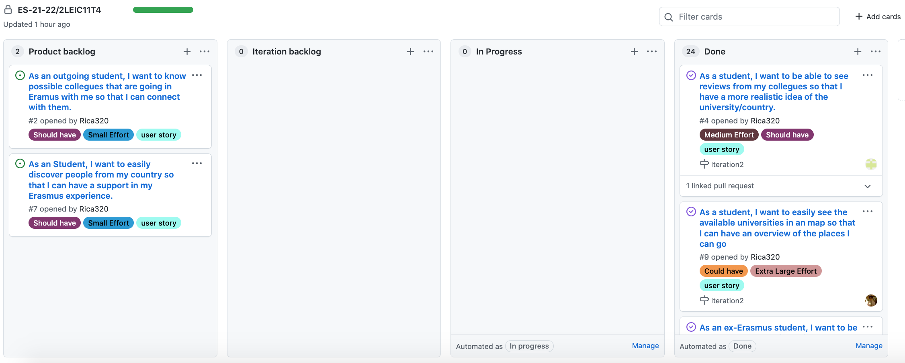

# ITERATION 1

Realese Link: <https://github.com/LEIC-ES-2021-22/2LEIC11T4/releases/tag/v0.3.0>

## Retrospective report (WEEK #2)

### 1. What worked well that we don’t want to forget?

O grupo trabalhou bastante, ultrapassando dificuldades e excedendo as próprias expectativas no que concerne a quantidade de trabalho efetuado.

### 2. What should we do differently?

Precisamos de adicionar mais testes de aceitação e realizar testes unitários. 

### 3. What still puzzles us?

Relativamente à iteração anterior, o grupo, como um todo, evoluiu postivamente no sentido de ser mais proeficiente no uso de Flutter. Contudo, ainda existe algumas peculiaridades da linguagem Dart às quais estamos a adaptar

