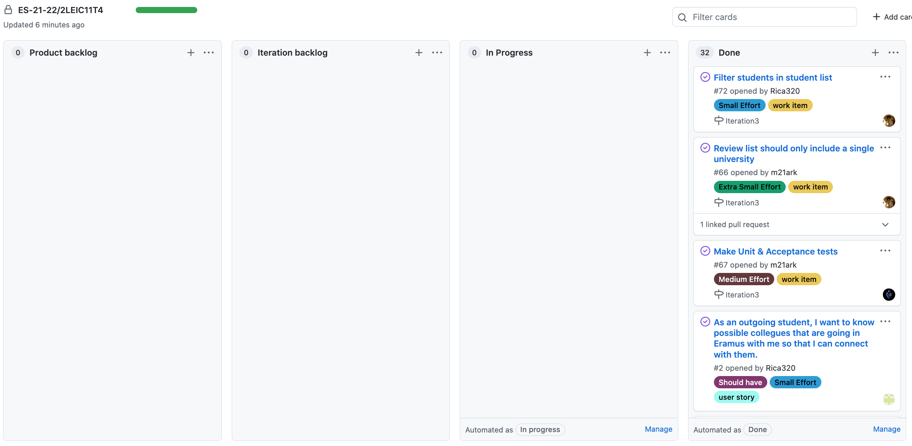

# ITERATION 3

Realese Link: <https://github.com/LEIC-ES-2021-22/2LEIC11T4/releases/tag/v1.0.0>

## Retrospective report (WEEK #3)

### 1. What worked well that we don’t want to forget?

Tudo correu de acordo com o planeado.

### 2. What should we do differently?

Tudo que estava para trás para ser melhorado foi melhorado.

### 3. What still puzzles us?

Conseguimos ser mais efecientes no flutter e conseguimos navegar bem no código do ni . Porém achámos que ainda podemos melhorar.

