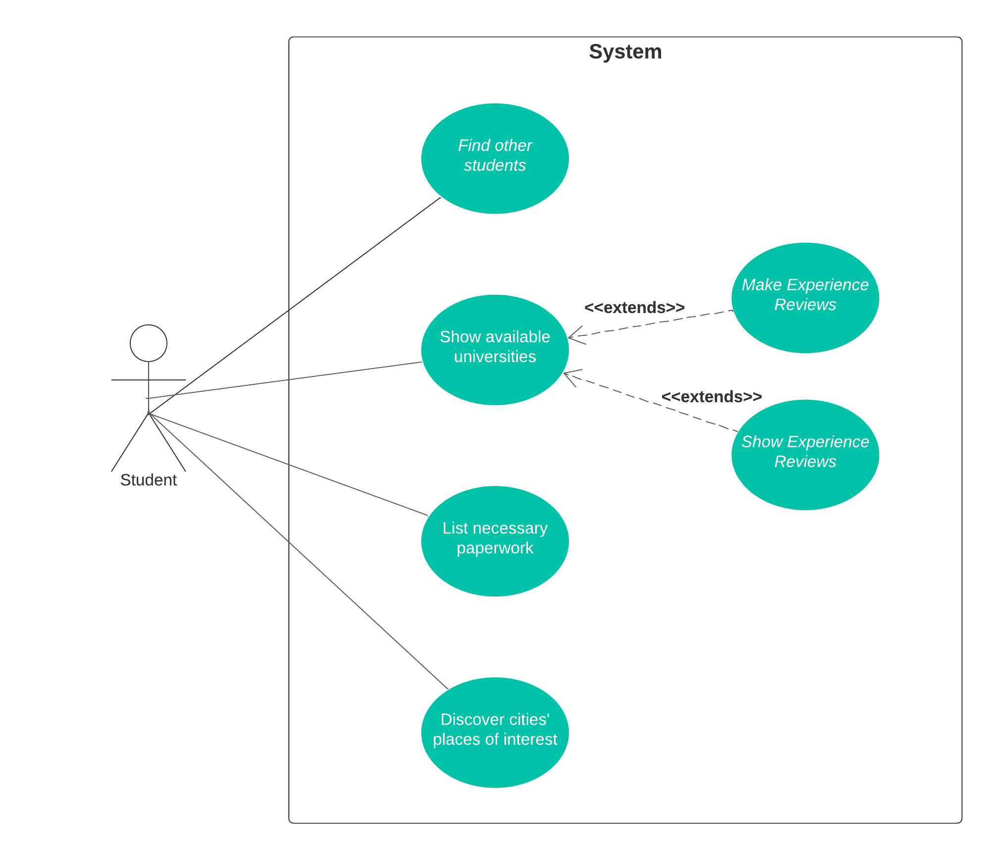

## Requirements
### Use case model 

  

Being logged in is a precondition to all the cases bellow.

#### Find other Erasmus students
|||
| --- | --- |
| *Name* | Find other Erasmus students |
| *Actor* |  Student | 
| *Description* | The user can find other Erasmus students.|
| *Preconditions* | The user doesn't need to register as an Erasmus student in the app to use this feature, but only Erasmus students will appear on the list. |
| *Postconditions* | N/A |
| *Normal flow* | 1. The user accesses the Erasmus section of the app.  2. The system asks the user to confirm if he is indeed an Erasmus student, in case he hasn't accepted before.   3. The system shows the list of other students and some information regarding them. (email and name)|
| *Alternative flows and exceptions* | N/A |

  

#### Show available universities

|||
| --- | --- |
| *Name* | Show available universities |
| *Actor* |  Student | 
| *Description* | The user can search for a list/map of the available universities and check some informations about them. |
| *Preconditions* | N/A |
| *Postconditions* | N/A |
| *Normal flow* | 1. The user accesses the Erasmus section of the app.  2. The system uses a map/list to show the universities.   3. The system shows information about the university chosen as well as the city. |
| *Alternative flows and exceptions* | N/A |

  

#### List necessary paperwork

|||
| --- | --- |
| *Name* | List necessary paperwork |
| *Actor* |  Student | 
| *Description* | Student can read some synthetized information and get useful links to find more about how Erasmus works and what is needed |
| *Preconditions* | N/A |
| *Postconditions* | N/A |
| *Normal flow* | A student can see some basic information about how Erasmus works. If it wants to learn more, some links are provided that take the user to the adequated sites. |
| *Alternative flows and exceptions* | The student might leave the app and be taken into a 3rd party website |

  

#### Discover cities' places of interest

|||
| --- | --- |
| *Name* | Discover cities' places of interest |
| *Actor* |  Student | 
| *Description* | The student is presented with a list of useful and historical places in a specific city |
| *Preconditions* | N/A |
| *Postconditions* | N/A |
| *Normal flow* | The student opens a city's page inside the app. Then a list with the most significant places in that city are shown with an image and some key information (like location) |
| *Alternative flows and exceptions* | N/A |

  

#### Make Erasmus experience reviews

|||
| --- | --- |
| *Name* | Make Erasmus experience reviews |
| *Actor* |  Student | 
| *Description* | A student has the option to tell the community about his experience in a certain university/city |
| *Preconditions* | The student must have selected a university |
| *Postconditions* | The review data must be stored in a database and be available to another student |
| *Normal flow* | 1. selects a university   2. rates and makes a comment   3. the send button is pressed   4. the review is available to other students |
| *Alternative flows and exceptions* | If the data cannot be stored due to lack of internet, then a error message must be shown |

  

#### Show Experience Reviews

|||
| --- | --- |
| Name | Show Experience Reviews |
| Actor |  Student | 
| Description | Student can see other students' review for a certain university/city |
| Preconditions | The student has chosen a university page to see |
| Postconditions | N/A |
| Normal flow | A student can see information about the university and reviews for that university / city made by other Erasmus students  |
| Alternative flows and exceptions | N/A |

### User stories
This section will contain the requirements of the product described as **user stories**, organized in a global **[user story map](https://plan.io/blog/user-story-mapping/)** with **user roles** or **themes**.

For each theme, or role, you may add a small description. User stories should be detailed in the tool you decided to use for project management (e.g. trello or github projects).

A user story is a description of desired functionality told from the perspective of the user or customer. A starting template for the description of a user story is 

*As a < user role >, I want < goal > so that < reason >.*

**INVEST in good user stories**. 
You may add more details after, but the shorter and complete, the better. In order to decide if the user story is good, please follow the [INVEST guidelines](https://xp123.com/articles/invest-in-good-stories-and-smart-tasks/).

**User interface mockups**.
After the user story text, you should add a draft of the corresponding user interfaces, a simple mockup or draft, if applicable.

**Acceptance tests**.
For each user story you should write also the acceptance tests (textually in [Gherkin](https://cucumber.io/docs/gherkin/reference/)), i.e., a description of scenarios (situations) that will help to confirm that the system satisfies the requirements addressed by the user story.

**Value and effort**.
At the end, it is good to add a rough indication of the value of the user story to the customers (e.g. [MoSCoW](https://en.wikipedia.org/wiki/MoSCoW_method) method) and the team should add an estimation of the effort to implement it, for example, using t-shirt sizes (XS, S, M, L, XL).

### Domain model

To better understand the context of the software system, it is very useful to have a simple UML class diagram with all the key concepts (names, attributes) and relationships involved of the problem domain addressed by your module. 
Also provide a short textual description of each class. 

Example:
 

  

