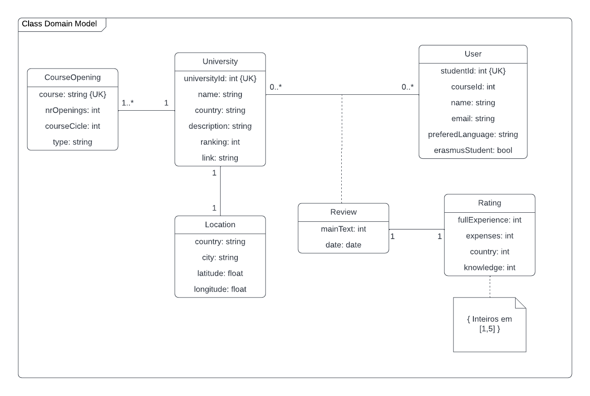

## Requirements
### Use case model 

  

Being logged in is a precondition to all the cases bellow.

#### Find other Erasmus students
|||
| --- | --- |
| *Name* | Find other Erasmus students |
| *Actor* |  Student | 
| *Description* | The user can find other Erasmus students.|
| *Preconditions* | The user doesn't need to register as an Erasmus student in the app to use this feature, but only Erasmus students will appear on the list. |
| *Postconditions* | N/A |
| *Normal flow* | 1. The user accesses the Erasmus section of the app.  2. The system asks the user to confirm if he is indeed an Erasmus student, in case he hasn't accepted before.   3. The system shows the list of other students and some information regarding them. (email and name)|
| *Alternative flows and exceptions* | N/A |

  

#### Show available universities

|||
| --- | --- |
| *Name* | Show available universities |
| *Actor* |  Student | 
| *Description* | The user can search for a list/map of the available universities and check some informations about them. |
| *Preconditions* | N/A |
| *Postconditions* | N/A |
| *Normal flow* | 1. The user accesses the Erasmus section of the app.  2. The system uses a map/list to show the universities.   3. The system shows information about the university chosen as well as the city. |
| *Alternative flows and exceptions* | N/A |

  

#### List necessary paperwork

|||
| --- | --- |
| *Name* | List necessary paperwork |
| *Actor* |  Student | 
| *Description* | Student can read some synthetized information and get useful links to find more about how Erasmus works and what is needed |
| *Preconditions* | N/A |
| *Postconditions* | N/A |
| *Normal flow* | A student can see some basic information about how Erasmus works. If it wants to learn more, some links are provided that take the user to the adequated sites. |
| *Alternative flows and exceptions* | The student might leave the app and be taken into a 3rd party website |

  

#### Discover cities' places of interest

|||
| --- | --- |
| *Name* | Discover cities' places of interest |
| *Actor* |  Student | 
| *Description* | The student is presented with a list of useful and historical places in a specific city |
| *Preconditions* | N/A |
| *Postconditions* | N/A |
| *Normal flow* | The student opens a city's page inside the app. Then a list with the most significant places in that city are shown with an image and some key information (like location) |
| *Alternative flows and exceptions* | N/A |

  

#### Make Erasmus experience reviews

|||
| --- | --- |
| *Name* | Make Erasmus experience reviews |
| *Actor* |  Student | 
| *Description* | A student has the option to tell the community about his experience in a certain university/city |
| *Preconditions* | The student must have selected a university |
| *Postconditions* | The review data must be stored in a database and be available to another student |
| *Normal flow* | 1. selects a university   2. rates and makes a comment   3. the send button is pressed   4. the review is available to other students |
| *Alternative flows and exceptions* | If the data cannot be stored due to lack of internet, then a error message must be shown |

  

#### Show Experience Reviews

|||
| --- | --- |
| Name | Show Experience Reviews |
| Actor |  Student | 
| Description | Student can see other students' review for a certain university/city |
| Preconditions | The student has chosen a university page to see |
| Postconditions | N/A |
| Normal flow | A student can see information about the university and reviews for that university / city made by other Erasmus students  |
| Alternative flows and exceptions | N/A |

### User stories
Check Github issues tagged as "user story".

### Domain model

 

  

### UI Mockup

Link to Figma full UI Mockup: <a>https://www.figma.com/proto/AQJF6zoCXgRvlYiLwTVjfT/Erasmus-Unite?node-id=0%3A1</a>
